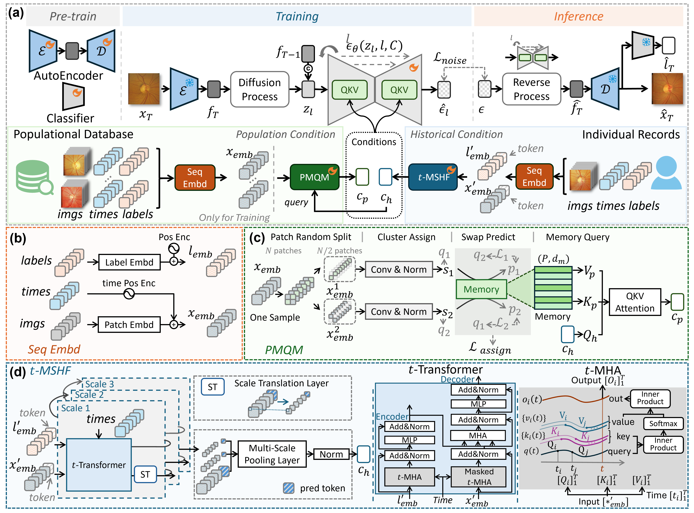
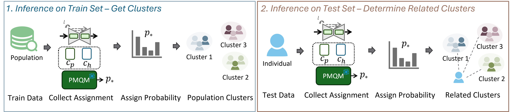

## 🩺 tHPM-LDM: Integrating Individual Historical Record with Population Memory in Latent Diffusion-based Glaucoma Forecasting

<div>
    <a href='https://scholar.google.com.hk/citations?user=Ogn7ufgAAAAJ' target='_blank'>Yuheng Fan</a> <sup>1</sup> &nbsp;
    <a href='https://scholar.google.com/citations?user=igrurhYAAAAJ&hl=zh-CN' target='_blank'>Jianyang Xie</a><sup>1</sup> &nbsp;
    <a href='https://scholar.google.com/citations?user=InHF3ykAAAAJ' target='_blank'>Yimin Luo</a><sup>2</sup> &nbsp; 
    <a href='https://yanda-meng.github.io/' target='_blank'>Yanda Meng</a><sup>3</sup> &nbsp; 
    <a href='' target='_blank'>Savita Madhusudhan</a><sup>4</sup> &nbsp;
    <a href='https://www.liverpool.ac.uk/people/gregory-lip' target='_blank'>Gregory Y.H. Lip</a><sup>5</sup> &nbsp;
    <a href='https://www.ece.ualberta.ca/~lcheng5/' target='_blank'>Li Cheng</a><sup>6</sup> &nbsp;
    <a href='https://pcwww.liv.ac.uk/~yzheng/' target='_blank'>Yalin Zheng</a><sup>1</sup> &nbsp;
    <a href='https://pcwww.liv.ac.uk/~hezhao/' target='_blank'>He Zhao</a><sup>1,*</sup> &nbsp;
</div>
<div>
    <sup>1</sup> Eye and Vision Sciences Department, University of Liverpool, Liverpool, UK &nbsp; <sup>2</sup> Department of Radiology, Weill Cornell Medicine, New York City, US &nbsp; <sup>3</sup> Computer Science Department, University of Exeter, Exeter, UK &nbsp; <sup>4</sup> St Paul’s Eye Unit, Liverpool University Hospitals NHS Foundation Trust, Liverpool, UK &nbsp; <sup>5</sup> Liverpool Centre for Cardiovascular Science, University of Liverpool, Liverpool, UK &nbsp;<sup>6</sup> Department of Electrical and Computer Engineering, University of Alberta, Canada &nbsp;
</div>
<div>
<sup>*</sup> Corresponding Author &nbsp; 
</div>

> (✨MICCAI 2025 Spotlight) Accepted by 28th International Conference on Medical Image Computing and Computer Assisted Intervention.


<!-- <a href=''></a> &nbsp; -->
 <!-- <a href=''></a> &nbsp; -->


## Introduction
We propose a glaucoma longitudial forecasting framework called tHPM-LDM. This method incorporates conditional modules, namely [`t-MSHF`](networks/tMSHF/tMSHF_imgfeature.py) and [`PMQM`](networks/PMQM/popu_memory.py) in conditional LDM for glaucoma fundus image prediction and category forecasting.

✅ Continuous-time modeling for longitudial records
✅ Considering popolation evolution for individual forecasting
✅ Retrievable popolation memory     



## 🕹️ Code and Environment
#### Step 1. Clone this Repository

```shell
git clone https://github.com/yhf42/tHPM-LDM.git
```
   

#### Step 2. Environment Setup

Make sure you have already installed Miniconda. Then, you can run [`setup.py`](./envs/setup.py) as:
```shell
cd ./envs
python setup.py --conda-dir "your_conda_env_path(e.g. /home/user/miniconda3)" --env-name "tHPM-LDM" --config-dir "./"
```

#### Step 3. Data Preparation

For LDM training and evaluation, you can firstly preparing [SIGF database](https://github.com/XiaofeiWang2018/DeepGF), then uses [`make_data_SIGF.py`](./datamodule/make_data_SIGF.py) process logitudial data into npz files as `SIGF_make` dataset. The example of making these npz files as:

```shell
cd ./datamodule
python make_data_SIGF.py --input_database_path /path/to/SIGF-database --output_make_path /path/to/output/SIGF_make
```
The structure of `SIGF_make` will be:
```shell
SIGF_make/
├── test/
│   ├── SD3434_OS_0.npz
│   ├── SD3434_OS_1.npz
│   └── ...
├── train/
│   ├── SD1284_OS_0.npz
│   ├── SD1284_OS_1.npz
│   └── ...
└── validation/
   ├── SD1006_OD_0.npz
   ├── SD1006_OD_1.npz
   └── ...
```
More details can refer to [`dataloader.py`](classifier/dataloader.py). You can also get the metainfo `SIGF_info.xlsx` of `SIGF_make` using [`stat_info.ipynb`](datamodule/stat_info.ipynb), which is useful for metric calculation. 

## 🔁 Inference
#### Step 1. Preparing Checkpoint
You can download all related checkpoints via [Google Drive](https://drive.google.com/drive/folders/17kJFalwqby-xFv7iyAvMKcgEiyMbBFsR?usp=sharing), and save them into `./pre-trained` as the follow structure: 

```shell
./pre-trained
├── hub
│   └── checkpoints
│       ├── inception_v3_google-0cc3c7bd.pth
│       ├── resnet18-f37072fd.pth
│       ├── resnet50-0676ba61.pth
│       └── vgg16-397923af.pth
├── image_classifier
│   └── classifier.ckpt
├── tHPM-LDM
│   └── tHPM-LDM.ckpt
└── VQGAN
   └── vqgan.ckpt
```

#### Step 2. Run the inference:
When you have `SIFG_make` dataset, you can firstly save this dataset at `data/SIGF_make`. The structure of the `SIFG_make` dataset woule be:
```shell
./data
└── SIGF_make/
    ├── test/
    │   ├── SD3434_OS_0.npz
    │   └── ...
    ├── train/
    │   ├── SD1284_OS_0.npz
    │   └── ...
    └── validation/
        ├── SD1006_OD_0.npz
        └── ...
```
Then, you can run the following bash script to get generative resutls:
```shell
bash ./script/test_tHPM-LDM.sh
```
After inferencing, you will have a folder, such as `test_LAtMSHFPMQM`, with a subfolder named `image`. You can take `test_LAtMSHFPMQM` as the `eval_path` for metric calculation.

## 🔧 Training

🤗(TODO) To better help you understand the structure of this project and use it for your research, we have prepared an [instruction manual](./assets/instruction.md) that introduces the main structure of the key modules.

#### Step 1: Pre-training 

For VQGAN pre-training, you can prepare the glaucoma fundus dataset as:
```shell
your/fundus_img/dataset_path/           # This is the base_dir
├── train/                              # Split directory for training data
│   ├── image001.jpg
│   ├── image102.png
│   └── ...
├── validation/                     # Split directory for validation data
│   ├── validation001.jpg
│   ├── validation102.png
│   └── ...
└── test/                           # Split directory for testing data   
    ├── test001.jpg
    ├── test102.png
    └── ...
```
More details can refer to [`single_fundus_2D_datamodule.py`](datamodule/single_fundus_2D_datamodule.py). Then, you can run the following bash script to get ckpt. More details are in [`train_vqgan.py`](train_vqgan.py)
```shell
bash ./scripts/train_vqgan.sh
```

For image classifier pre-training, , you can prepare the glaucoma fundus dataset as:
```shell
your/fundus_img/dataset_path/           # Base directory
├── train/                              # Training set
│   ├── 0/                              # Class 0 (negative)
│   │   ├── dataset1_image001.jpg       
│   │   ├── dataset1_image002.png
│   │   └── ...
│   └── 1/                              # Class 1 (positive)
│       ├── dataset1_image101.jpg
│       ├── dataset2_image102.png
│       └── ...
├── validation/                         # Validation set
│   ├── 0/                              # Class 0 (negative)
│   │   ├── SIGF_val001.jpg
│   │   ├── SIGF_val002.png
│   │   └── ...
│   └── 1/                              # Class 1 (positive)
│       ├── SIGF_val101.jpg
│       ├── SIGF_val102.png
│       └── ...
└── test/                               # Test set
    ├── 0/                              # Class 0 (negative)
    │   ├── SIGF_test001.jpg
    │   ├── SIGF_test002.png
    │   └── ...
    └── 1/                              # Class 1 (positive)
        ├── SIGF_test101.jpg
        ├── SIGF_test102.png
        └── ...
```
More details can refer to [`dataloader.py`](classifier/dataloader.py). Then, you can run the following bash script to get ckpt. More details are in [`train_classifier.py`](train_classifier.py)
```shell
bash ./scripts/train_classifier.sh
```

#### Step 2: LDM training
Once you have the `SIGF_make` dataset and pre-trained VQGAN, you can run the following bash script to train the LDM and condition modules all-in-once. More details are in [`train_vqldm_PMN.py`](train_vqldm_PMN.py).
```shell
bash ./scripts/train_tHPM-LDM.sh
```
## 🔍 Retrieve
We implement the memory retrieve in [`retrieve_vqldm_PMN.py`](retrieve_vqldm_PMN.py), which mainly relies on [`retrivalble estimator`](./ldm/modules/diffusionmodules/openaimodel_tMSHF_PMQM.py) and [`retrivalble PMQM`](ldm/modules/condition_gen_MSTFCM_PopuMemory_retrive.py). All of these files are similar to their non-retrievalbe version, except outputing assign probability. Retrieving memory contains three steps as shown in the following figure:


#### Step 1: Collecting the assign probability 
Before retrieving the population memory in PMQM, we firstly need inference our trained model over training and testing samples via [`retrieve_vqldm_PMN.py`](retrieve_vqldm_PMN.py) to get the assignment. The way to get such assignment is unning the following bash scripts:
```shell
bash ./scripts/retrieve_infer.sh
```

#### Step 2: Builing offline cache over training samples
The way to build up the offline cache among training samples can refer to the instruction in [`1-build_offline_bank.ipynb`](retrieve/1-build_offline_bank.ipynb).

#### Step 3: Getting the related cluster of each test sample
Following the instruction in [`2-get_assigment_of_test_results.ipynb`](retrieve/2-get_assigment_of_test_results.ipynb), we will have the top-5 related assign cluster of each test sample.

## 📜 Citation
If you find our project helps your research, please cite us as:
```tex
@InProceedings{FanYuh_tHPMLDM_MICCAI2025,
        author = {Fan, Yuheng and Xie, Jianyang and Luo, Yimin and Meng, Yanda and Madhusudhan, Savita and Lip, Gregory Y.H. and Cheng, Li and Zheng, Yalin and Zhao, He},
        title = {{tHPM-LDM: Integrating Individual Historical Record with Population Memory in Latent Diffusion-based Glaucoma Forecasting}},
        booktitle = {proceedings of Medical Image Computing and Computer Assisted Intervention -- MICCAI 2025},
        year = {2025},
        publisher = {Springer Nature Switzerland},
        volume = {LNCS 15960},
        month = {September},
        page = {622 -- 632}
}
```

## 🌼 Acknowledgements
We sincerely appreciate the code release of the following projects: [SIGF](https://github.com/XiaofeiWang2018/DeepGF), [LDM](https://github.com/CompVis/latent-diffusion), [C2F-LDM](https://github.com/ZhangYH0502/C2F-LDM), [PhysioPro](https://github.com/microsoft/PhysioPro/tree/main), [SwAV](https://github.com/facebookresearch/swav).

 